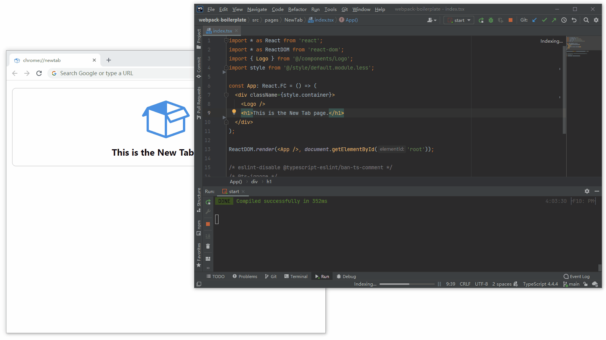
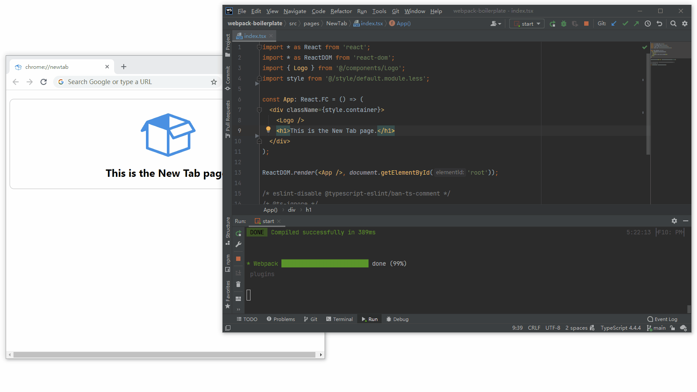
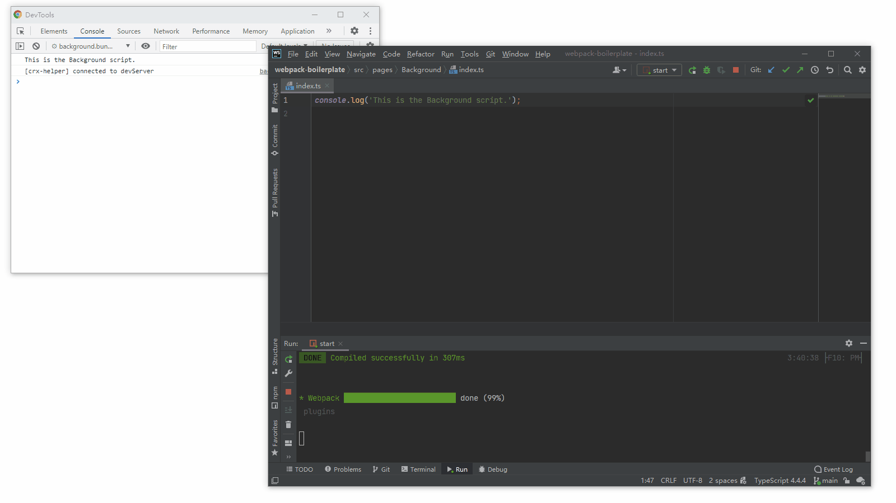
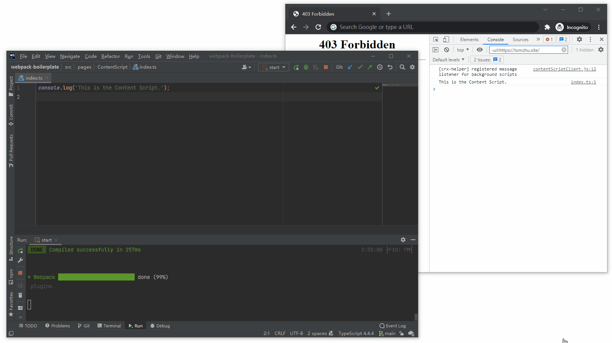

# Webpack Boilerplate

A good starting point for using webpack to build stuffs.

## Screenshots

- [HMR (Hot Module Replacement)](https://webpack.js.org/concepts/hot-module-replacement/)



- Error overlay



- Auto-Reload for Background scripts in Chrome Extension development



- Auto-Refresh for Content Scripts in Chrome Extension development



## Features

- Webpack 5, React 17, TypeScript, Less
- Ant Design, Lodash, jQuery
- Support [HMR (Hot Module Replacement)](https://webpack.js.org/concepts/hot-module-replacement/)
- Support Auto-Reload and Auto-Refresh for Chrome Extensions
- Support Chrome Extensions Manifest V3
- Lint codes with [ESLint](https://www.npmjs.com/package/eslint) + [stylelint](https://www.npmjs.com/package/stylelint) + [Prettier](https://www.npmjs.com/package/prettier)
- Lint commit messages with [commitlint](https://www.npmjs.com/package/@commitlint/cli)
- Automated pre-commit code check with [husky](https://www.npmjs.com/package/husky) + [lint-staged](https://www.npmjs.com/package/lint-staged)

## How to Use

### Update webpack Configurations

- Open `webpack.config.js`;
- Update configuration field `entry` to determine what to be built;
- Update configuration field `boilerplateConfig.notHotReload` to determine which entries to be excluded from [HMR (Hot Module Replacement)](https://webpack.js.org/concepts/hot-module-replacement/);
- (Chrome extension development only) update configuration field `boilerplateConfig.backgroundScripts` and `boilerplateConfig.contentScript` to match the entries of Background scripts and Content Scripts;

### CLI Commands

```shell
# Install dependencies
yarn install

# Start Dev Server
yarn run start

# Start building
yarn run build

# Start building with bundle analyzer
yarn run build:analyzer

# Run type check
yarn run type-check

# Lint all files
yarn run lint

# Lint all files and try to fix issues
yarn run lint:fix

# Lint script files
yarn run eslint

# Lint script and try to fix issues
yarn run eslint:fix

# Lint style files
yarn run stylelint

# Lint style files and try to fix issues
yarn run stylelint:fix

# Run prettier
yarn run prettier

# Run prettier and try to fix issues
yarn run prettier:fix
```

## Notes

### How to Enable HMR

To enable [HMR (Hot Module Replacement)](https://webpack.js.org/concepts/hot-module-replacement/) in your code, append the following code at the end:

```typescript
/* eslint-disable @typescript-eslint/ban-ts-comment */
/* @ts-ignore */
if (module.hot) module.hot.accept();
```

Without this code, it is likely that there will only be *live reload* rather than *HMR*.

### HMR in Chrome Extension Development

In Chrome extension development, some entries *does not* support [HMR (Hot Module Replacement)](https://webpack.js.org/concepts/hot-module-replacement/). Two typical examples are the Content Scripts (which lack the permission to establish a connection with the Dev Server to receive new changes) and the Background script (which is now a service worker under manifest v3 and has no global `document` node that the HMR requires to work).

One possible solution to achieve a similar effect is to inject clients in the Background script and the Content Scripts and set-up a customized middleware in the Dev Server. The client in the Background script establishes a long connection with the Dev Server. When the Dev Server announces a code change in the Background scripts, the client in the Background scripts *reload* the entire extension with `chrome.runtime.reload()`; when the Dev Server announces a code change in the Content Scripts, the client in the Background script communicate with the client in the Content Scripts with `chrome.runtime.sendMessage()`, and the client in the Content Scripts *refresh* the page. This *Auto-Reload* and *Auto-Refresh* approach makes the new changes in the code to be applied immediately and eliminates some tiny troubles. However, unlike HMR, which can preserve *state* of the code, this approach will inevitably lose all *state* of the code, which can be unwanted in some cases.

For Background scripts and Content Scripts, please add their entries in the configuration field `boilerplateConfig.notHotReload` to exclude them from [HMR (Hot Module Replacement)](https://webpack.js.org/concepts/hot-module-replacement/). It is optional to configure `boilerplateConfig.backgroundScripts` and `boilerplateConfig.contentScript`, configure them only if you wish to enable the *Auto-Reload* and *Auto-Refresh* functionality.

## Credits

- <div>Icons made by <a href="https://www.flaticon.com/authors/freepik" title="Freepik">Freepik</a> from <a href="https://www.flaticon.com/" title="Flaticon">www.flaticon.com</a></div>

- [tjx666/awesome-chrome-extension-boilerplate](https://github.com/tjx666/awesome-chrome-extension-boilerplate)

- [lxieyang/chrome-extension-boilerplate-react](https://github.com/lxieyang/chrome-extension-boilerplate-react)

